封面来源：[《明日方舟：终末地》官方网站](https://endfield.hypergryph.com/)

*其实我在打标题的时候在想，明日方舟：终末地 中间这个冒号是中文的还是英文的；最后复制了官方启动器名字才发现是中文的。*

:::tips
这是一篇主观色彩较为浓重的文章！如与您观点不符，请包容。
:::

# 什么类型

这是一款什么类型的游戏呢？

这是一款箱庭式单机游戏，至少目前不支持联机功能。

## 共享家园

首先，必不可少的就是对于**死亡搁浅**游戏玩法的借鉴，如果你没玩过死亡搁浅也没关系，我会向您介绍：

在对于世界探索的过程中，你可以放置一些设备；这些设备通常来自于您在基地中的制作。

例如以上图片，是我在探索途中为了方便日后**收集物品**而制作的滑索架。

如果你仔细观察，会发现其显示有30人维修过，这正与死亡搁浅中的设定相似：玩家在世界中可以看到其他玩家放置的装置并给予维护。

你可能会有疑问：

- 我放置的设备都会被其他玩家所看到吗？

不完全是，目前可以由玩家所看到的设备类型有以下几种：

1. 战斗辅助类
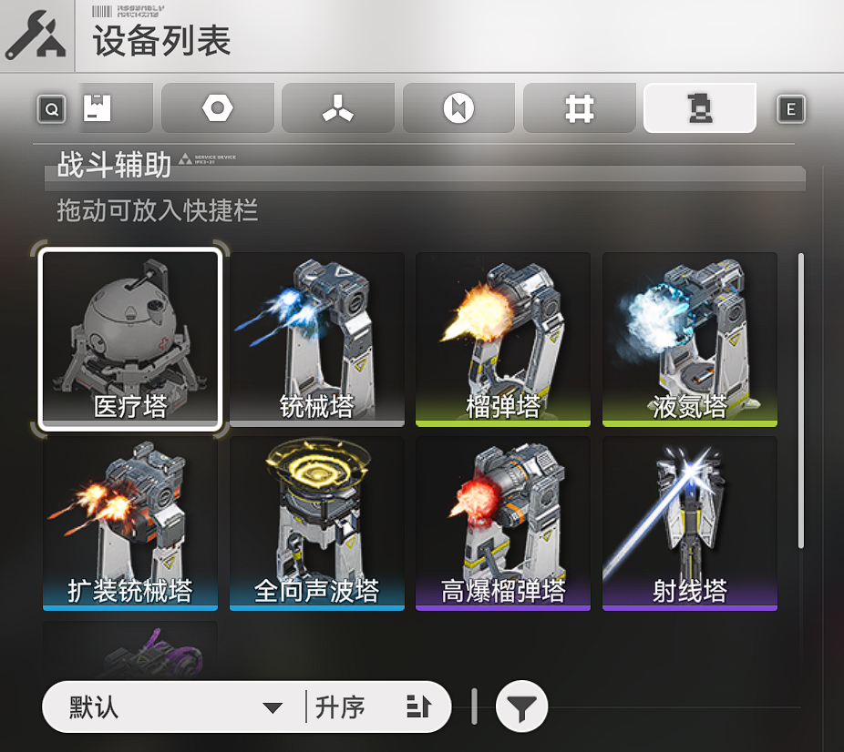

2. 功能设备类
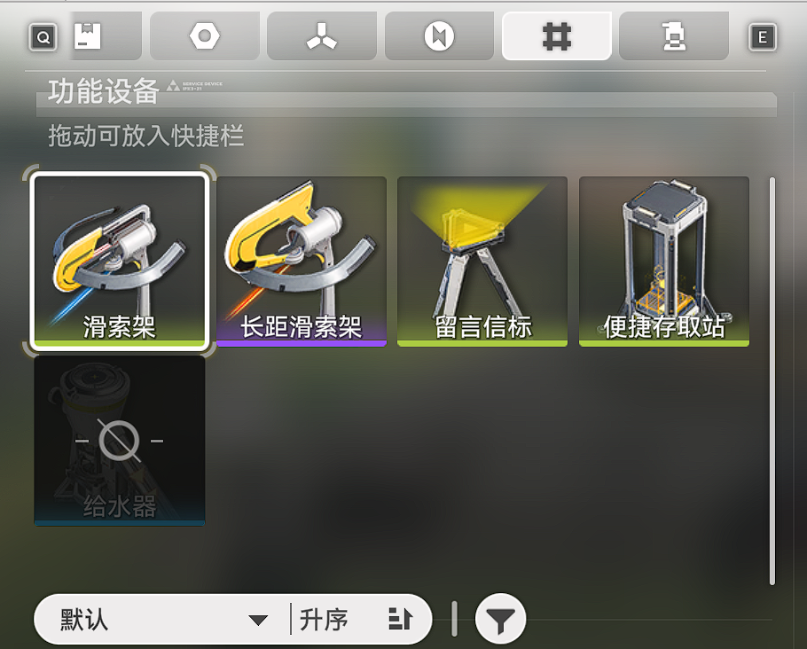

只有这两种类型能被其他玩家所看到。

- 设备会一直存在于地图中吗？

自己放置的设备会一直存在于地图中，其他玩家的设备会有耐久度（需要定时维护）否则将会消失。不过还会出现其他玩家的设备的！

- 我可以随意放置吗？

并不是，所有设备均有数量限制，除了留言信标无需供电外，您所放置的设备都需要有供电才可运行。

## 基建

核心玩法，如果你要畅玩终末地，基建是必不可少的一部分。

- 基建可以获得什么？

装备合成材料均需基建来获取：

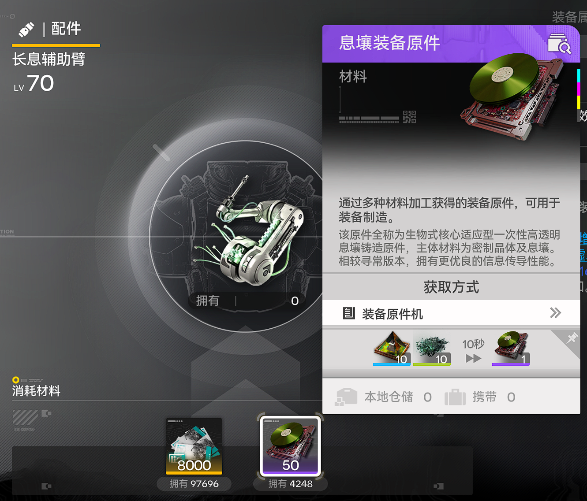

你可以看到，消耗50装备原件与8000调度卷才可以合成一个装备，而调度券并非游戏货币，而是通过基建以及任务获取的：

你的基地流水线建成后即可生产物资，生产的物资可以在其他据点售卖：

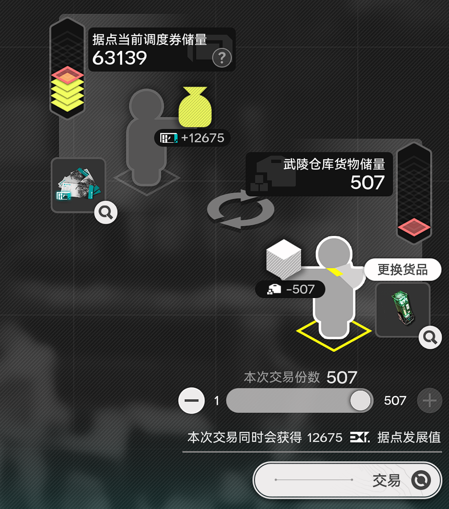

同时，调度券也可以用来交易：

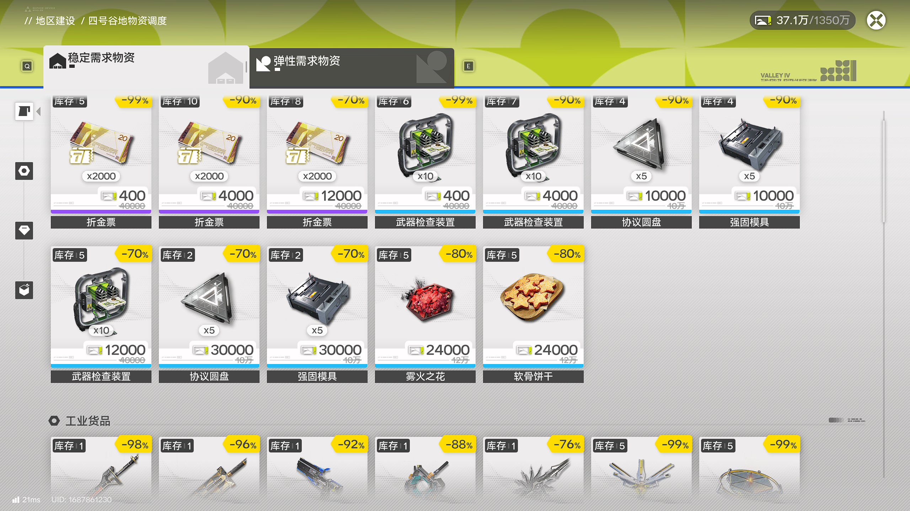

所以，如果你想要玩的爽，就必须制作产线来全自动生产物资。

当然，如果你实在不感兴趣，官方提供了蓝图功能：

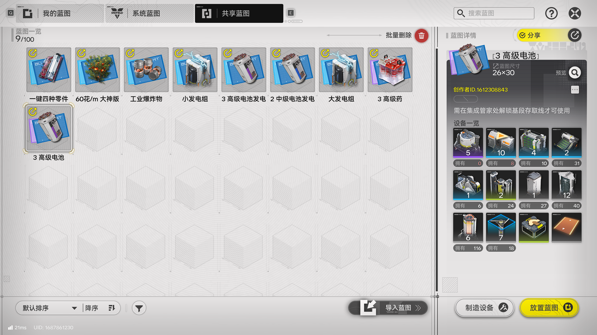

## 拉电线（跑图）

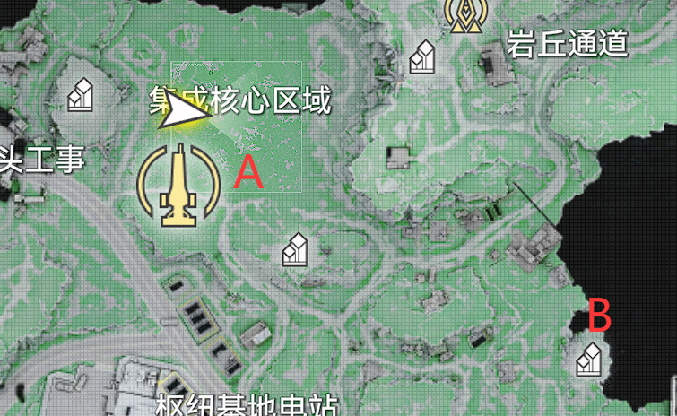

如图，A点是你的基地，而B点为矿点，你要怎么去开采呢？

你可能会想，去那里放一个矿机即可；但前文说过，所有设备都需要用电功能，这就牵扯到了另一个不得不品的一环：拉电线。

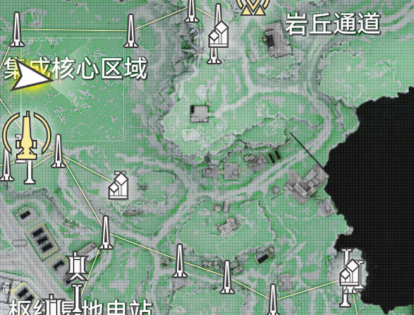

图中黄色的就是电线，你需要通过中继器将电力从核心区运输到矿点。

每个中继器的距离为80米。

而除了枢纽区外，四号谷底还有五个区域：

这五个区域的路是相连的，所以你跑图时并不用加载，更好的拉电线到其他区域了。

当然，并不是让你一路从枢纽区拉完所有区域的，在其他的部分区域提供了分基地，虽然没有主基地大，但是自带电力，你可以建设一些小产线，也可以从那里直接拉电线。

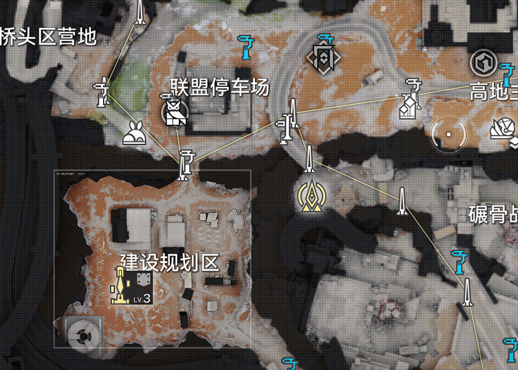

## 战斗

在此游戏中，一个小队为四个人，你需要使用键盘的1234来释放四个人技能。通过长按技能键释放终结技。

你只能控制一个角色，其他角色也会在场上自动帮你战斗。

但是技能会有所改变，例如有些技能只有在主控的情况下会有额外收益：

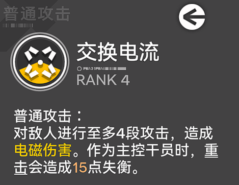

而角色技能的释放需要消耗战技点，战技点是缓慢恢复的（通过闪避等可以增加一些充能），且共享。最多存储三个，你需要考虑给谁使用。

## 角色养成

一个角色可以分为以下几个养成模块：

### 武器

角色的武器不仅可以升级，也可以使用**基质**来进行提升武器技能。

如图所示，一个武器拥有三个技能。而基质可以给这些技能升级：

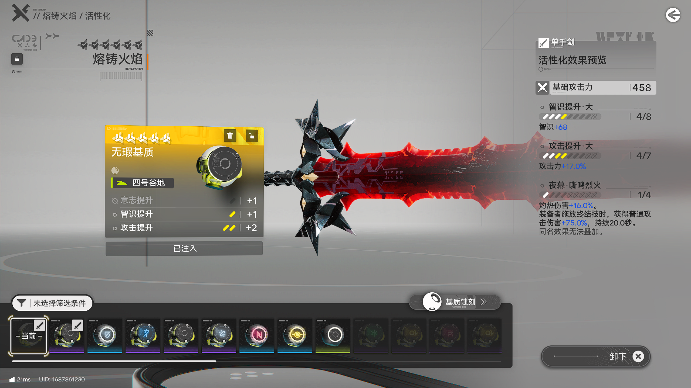

你可以使用刻写券来指定基质的部分属性，刻写券需要使用调度券购买，并将调度系统升级到四级。

### 装备

除了默认的装备外，你可以选择携带一类战术物品，战术物品将在战斗中自动使用，最大自动使用次数为三次。

### 潜能

无需多言，抽卡游戏标配。

### 技能，天赋，等级

技能保留了明日方舟相关设定，可以专精。

等级提升中需要达到特定等级才可以穿戴相应品质的装备。

有些天赋需要信赖解锁，你可以将干员放置在帝江号中工作来提示信赖（什么时候搞个一键换班就好了）：

你还可以在帝江号中碰到某些干员：

ta还会送你礼物哦

当然，你也可以送她礼物提升信赖！

# 我适合吗？

终末地的受众并不是那么广，如果它对你胃口，那将是一款非常不错的游戏。

## 我是受众吗？

如果你对解密+沙盒+模拟经营（自动化产线）类感兴趣的话，那么终末地将是你不可或缺的游戏。

市面上并没有类似的游戏先例。相反，如果你对某一个感到厌恶的话，那么终末地对于你的游戏体验并不会很好。

我在开服后就一直游玩，与第二天就前往了武陵城。虽然不是最快的，但也是第二快的了。

武陵城对于四号谷底来说根本不是一个级别的。我真的很推荐大家都前往武陵城看看。

# 不足

在我感觉中，鹰角为了掩饰自己产能不足做了很多设计，而这些设计恰恰很失败。

例如为了早早前往武陵，我就一开始全速推进主线，而主线是有卡等级这一设定的。你需要达到一定等级才可以继续进行。

恰恰是这个设定，卡了我三四次，在15级，18级，25级，34级，43级才可以推进下一个主线，你做完一部分主线还到不了下一个等级，例如34级做完后最多升一级，你要等好久才可以继续进行。

还有抽卡资源的不足，虽然在开服后能肝到120抽保底，但所需的时间太久了，如果你歪了那么只有到主线推完任务做完才能吃到最后的保底。

虽然我并没有歪，但截止到现在，我在抽了80抽后还能拿出来40抽。

这还不包括我第三次测试充值返利等效20抽的前提下。

而且卡池120抽保底不继承，这就摆明如果没有120抽，就不要抽卡。

还有战斗感觉差点意思，技能共享战绩点导致大部分用来给主控干员使用。

# 优点

如果你是一个享受者，可以接受或包涵上述缺点，那么还是一款很好的游戏。

现代二游前列的优化与画质，特殊的游戏玩法与设定，好看的界面UI...

总之，这款游戏非常适合我！我是推荐游玩的。

