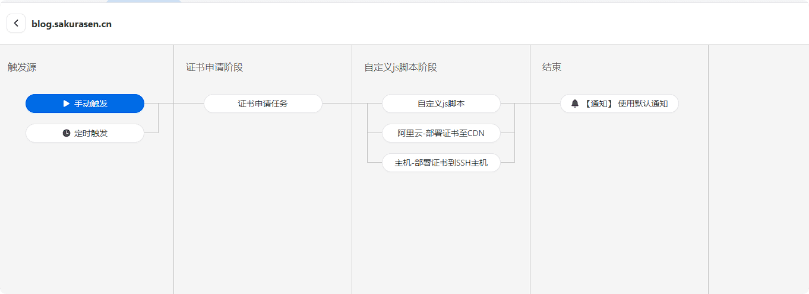
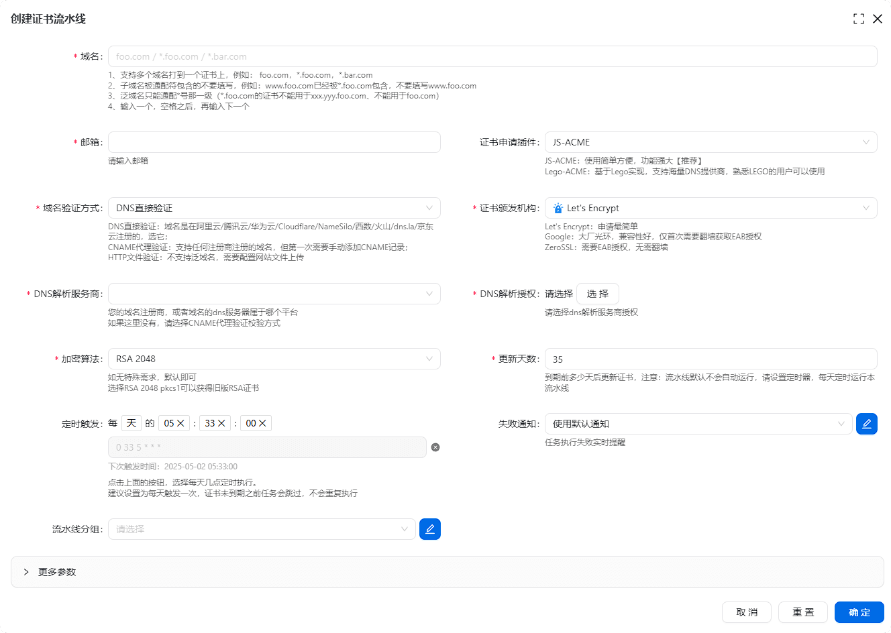
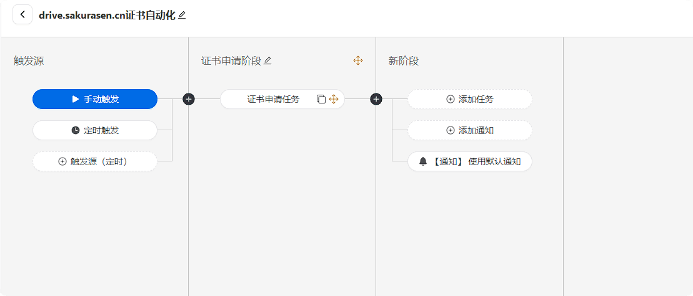
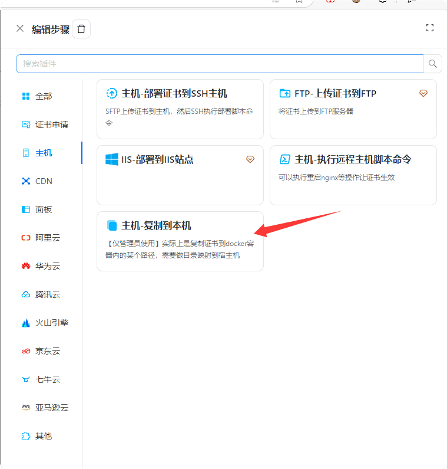

## SSL证书怎么那么坏

很久以前，我记得SSL证书只需要一年一申请，不知何时，改成了三个月。

如果你是付费用户当我没说。

## 全自动化申请SSL证书

得益于**Certd**我们可以使用流水线自动化部署SSL证书

[Github](https://github.com/certd/certd) | [官网](https://certd.docmirror.cn/)



## 开始部署

CertD提供了非常多的部署方式，几乎没有学习成本
[文档地址](https://certd.docmirror.cn/guide/start.html)

这里，我使用的是Docker部署，下方引用官网例子：

```
#随便创建一个目录
mkdir certd

#进入目录
cd certd

#下载docker-compose.yaml文件，或者手动下载放到certd目录下
wget https://gitee.com/certd/certd/raw/v2/docker/run/docker-compose.yaml

#可以根据需要修改里面的配置
#1.修改镜像版本号【可选】
#2.配置数据保存路径【可选】
#3.修改端口号【可选】
vi docker-compose.yaml #【可选】

#启动certd

docker compose up -d
```

如果提示 没有docker compose命令,请安装docker-compose
<https://docs.docker.com/compose/install/linux/>

部署完后，请访问7001与7002端口查看可用性。

默认账号密码：**admin/123456**

## 邮件通知

进入管理后台，你可以先配置邮件通知。


若不想配置，则直接可以开始创建证书流水线

## 证书流水线


点击新建一个证书流水线


按照提示选填

证书签发机构推荐使用Google，若使用Let's Encrypt则可能造成不信任的证书[查询地址](https://myssl.com/)。

只是第一次使用需要前往Google获取EAB授权。
[获取教程](https://certd.docmirror.cn/guide/use/google/)
获取后无需服务器在海外也可申请Google证书

当你一切完毕后，你将会看到以下界面


若一切正常，你可以先点击手动触发测试

一切正常，申请成功，那很棒了！

你可以返回上一级查看证书


## 自动化部署

### 雨云虚拟主机

若你和我一样，使用雨云虚拟主机（现已停售）。则需要先去[SSL证书中心](https://app.rainyun.com/apps/ssl/list/free-ssl)手动添加证书

当你手动添加后，会获得一个ID

然后去编辑流水线

添加任务

其他中选择js脚本


脚本内容如下
```js
const certPem = ctx.self.cert.crt
const certKey = ctx.self.cert.key

//axios发起http请求上传证书
const res = await ctx.http.request({
	url: "https://api.v2.rainyun.com/product/sslcenter/这里改为你的SSL证书ID",
	headers: {
		'x-api-key': '此处填写你的雨云API'
	},
	method: "put",
	data: {
		cert: certPem,
		key: certKey
	}
})
if (!res || res.code !== 200) {
	//抛异常才能让任务失败
	throw new Error("上传失败")
}
//不能用console.log，需要用ctx.logger 才能把日志打印在ui上
ctx.logger.info("上传成功", res.data)
```

这个脚本是我用官网示例脚本改的，请按照内容填写两处
[雨云API获取](https://app.rainyun.com/account/settings/api-key)

[证书ID获取](https://app.rainyun.com/apps/ssl/list/free-ssl)

其他内容无需改动。

添加后再次申请即可自动上传至雨云。

记得在配置文件添加SSL端口
---
listen 443 ssl http2 ;
---


### 宝塔面板

其实Certd有宝塔面板一键部署，不过为高级版功能


如果你不想付费，则可以换种方法。

> 此功能未经测试，仅为理论

如果你的web和certd在同一台服务器，则只需要复制到本机即可


如果在另一台服务器，则需要上传至服务器


然后打开站点配置文件，增加SSL证书目录

```nginx
    ssl_certificate    证书目录;
    ssl_certificate_key    密钥目录;
    ssl_protocols TLSv1.1 TLSv1.2 TLSv1.3;
    ssl_ciphers EECDH+CHACHA20:EECDH+CHACHA20-draft:EECDH+AES128:RSA+AES128:EECDH+AES256:RSA+AES256:EECDH+3DES:RSA+3DES:!MD5;
    ssl_prefer_server_ciphers on;
    ssl_session_cache shared:SSL:10m;
    ssl_session_timeout 10m;
    add_header Strict-Transport-Security "max-age=31536000";
    error_page 497  https://$host$request_uri;
```

### CDN部署

