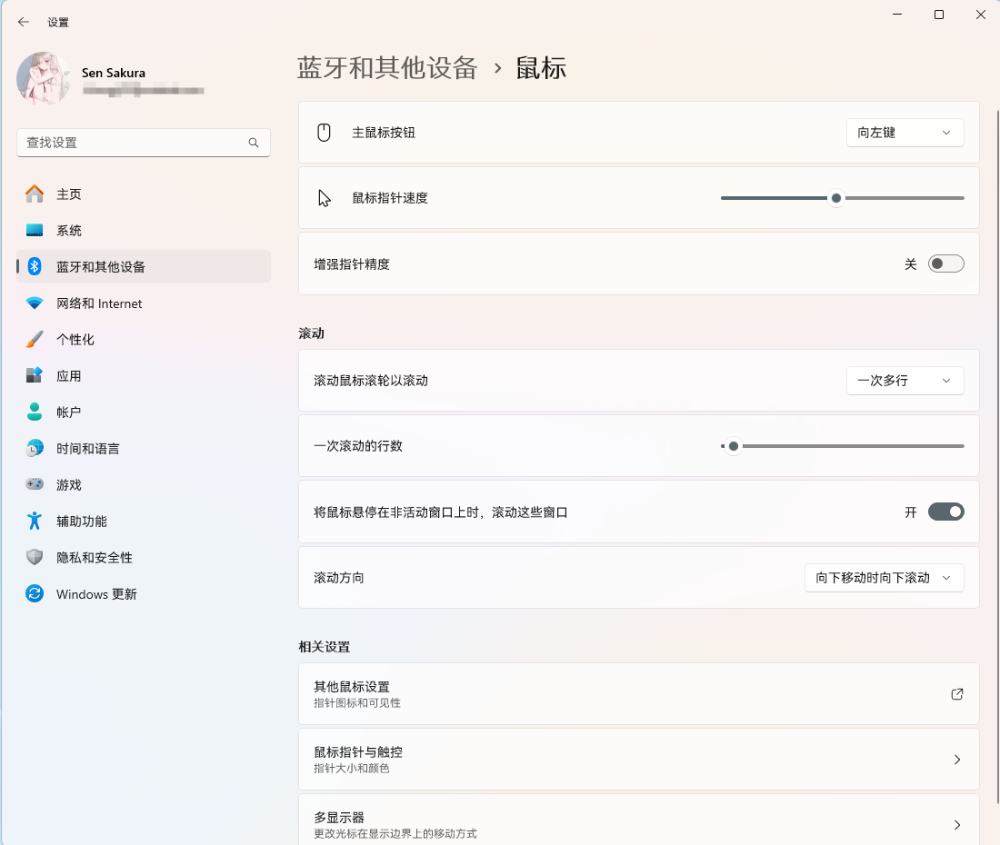

## 开头

如标题所见，我进行了一次系统重装。

作为~~科研人员~~爱折腾的用户。重装系统是一件如同喝水睡觉吃饭一样正常的事情。

为什么重装呢，是因为Arch占了我一整个盘，而上次重装完系统一直在研究网站开发，把我存储空间全占完了！~~其实是下了300多G的涩图~~

**还有，没事别想着装Linux。**

如果你是一个特别普通的用户，那么Linux对你来说也许没有太多的吸引力。

你在Linux能做到的事情，Windows能做的更好。

如果你试着去装Linux，那么也许只是你需要Linux作为深度学习的环境？

那也算不算普通用户了。

好了，废话不多说了，这篇文章主要是介绍一下重装完系统我会干什么。

## 系统选择

我一般不喜欢直接装原版系统，因为太过于臃肿。

系统方面我选择的是不忘初心游戏版[不忘初心系统博客-精简版系统官网](https://www.pc528.net/)

## 系统设置

### 关闭鼠标精度

打FPS好像有影响，我一直都是关的，习惯了已经

## 软件选择

### 浏览器

进入系统第一步是下载浏览器。

我装的这个系统没自带Edge，自带了IE，庆幸的是用到的网站还支持IE。

[下载 Microsoft Edge](https://www.microsoft.com/zh-cn/edge/download)

[Google Chrome 网络浏览器](https://www.google.cn/intl/zh-CN/chrome)

### 驱动

[处理器和显卡驱动程序及支持](https://www.amd.com/zh-cn/support/download/drivers.html)

[罗技 G HUB 游戏软件](https://www.logitechg.com/zh-cn/innovation/g-hub.html)

### 开发软件

[Visual Studio Code - Code Editing. Redefined](https://code.visualstudio.com/)

[Git - 安装 Git](https://git-scm.com/book/zh/v2/%E8%B5%B7%E6%AD%A5-%E5%AE%89%E8%A3%85-Git)

[Download Termius for Windows](https://termius.com/download)

### 通讯软件

[QQ Windows版-轻松做自己](https://im.qq.com/pcqq/index.shtml)

### 游戏

[欢迎来到 Steam](https://store.steampowered.com/)

*天下无人不识君*

[无畏契约官方网站-腾讯游戏](https://val.qq.com/)

[《三角洲行动》全新黑夜之子赛季4月17日正式上线-新一代战术射击品质标杆-腾讯游戏](https://df.qq.com/main.shtml)

[MuMu模拟器官网\_安卓12模拟器\_网易手游模拟器](https://mumu.163.com/)

### 视频软件

[下载 \| OBS](https://obsproject.com/zh-cn/download)

