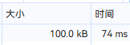
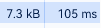
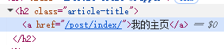
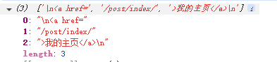

## 前情提要

在重写我的个人主页的时候，我有想过一个需求。

把我的网站文章（最新）展示到我的主页上。

我想过三种方法：

- 通过请求[RSS订阅](https://blog.sakurasen.cn/index.xml)地址。
- 通过请求[博客的网页](https://blog.sakurasen.cn/)。
- 配置API，自动执行上述两条返回数据。

由于比较懒(make=lazy)。

所以直接忽视第三条，再来说第一条：

通过直接打开地址会发现



请求了100kB，很难接受。

所以最后选择了**第二条的方案**，只需请求**7kb**：



很棒，不是吗？

## 开始

我选择的是**fetch**来进行网络请求。

随便选什么，请求就行。

TS写法：
```ts
let blogurl = "https://blog.sakurasen.cn"
let str = '"'
let loadding = ref(false)
let x = reactive([])
//定义变量
function get() {

    fetch('https://blog.sakurasen.cn/')

        .then(response => {

            return response.text()
//返回请求数据
        })

        .then(html => {

            const parser = new DOMParser();
//创建新DOM
            const doc = parser.parseFromString(html, 'text/html');

            x = Array.from(doc.querySelectorAll(".article-title")).splice(0,3)
//将变量定义为选择的标题Class
//我使用的主题标题Class就是这个
//选择前三篇文章
            loadding.value = true
//示意DOM可以加载内容了
        })

}
```

不知道写的怎么样，虽然很难，但我还是做到了。

说一下`x = Array.from(doc.querySelectorAll(".article-title"))`

在Stack主题中，标题的class就是这个，如果你是其他主题，修改为你的标题Class样式即可




DOM:
```vue

  <div v-if="loadding">
//需要等待异步加载完才可加载
      <h1>近期的文章</h1>

      <div v-for="t in x"><a
//vfor循环
              :href='blogurl + t.innerHTML.split(str)[1]'>{{ t.innerText
//拼接地址
              }} // <i>{{ t.nextSibling.nextSibling?.innerText ?? '暂无简介' }}</i></a></div>
              如果没有返回简介的地址，就是默认提示暂无简介

  
```

为什么要写这个：

` blogurl + t.innerHTML.split(str)[1]`

因为t.innerHTML输出是这样的

`<a href="/post/index/">我的主页</a>`

那么用split分割后就是



恭喜你，完成了~