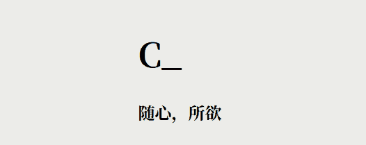

## 效果展示


## 我是怎么写的

```ts
  
import { computed, ref } from 'vue';
//引入库
const titles = ["Hi,I am SEN", "你好！我是SEN！",

    "こんにちは！私はSENです！",

    "안녕하세요! 저는 SEN입니다!",

    "¡Hola! ¡Soy SEN!",

    "Salut ! Je suis SEN",

    "Привет! Я SEN!",

    "Olá! Eu sou o SEN!",

    "Halo! Aku SEN!",

    "Ciallo～(∠・ω< )⌒☆",
];
//定义一个标题组

  

let i = ref(0)
//定义变量
let disp = ref("Loading...")
//未完成加载显示的标题
function titlesreturn() {

    let leng = titles[i.value].length
//定义一个变量，其等于第i个标题的长度
    let x = 1
//定义一个变量x，让其为1
    const timer1 = setInterval(() => {
//计时器
        if (x <= leng) {
//如果x小于等于第i个标题的长度
            disp.value = titles[i.value].slice(0, x) + "_"
//显示第i个标题的第0位到第x位，后面加上“_”
            x++
//然后x自增
        } else {
//如果比第i个标题长度大
            const timer2 = setInterval(() => {
//启动第二个计时器，再给它删了
                if (x > 0) {
//如果x大于0
                    x--
//x自减
                    disp.value = titles[i.value].slice(0, x) + "_"
//显示第0位到第x位
                } else {
//如果x等于小于0
                    if (i.value == titles.length-1) {
//如果i的值等于标题数组的总数（这里写titles.length-1是因为tmd数组假如有10位，那么titles.length显示的是10，但是tmd你只能取到9，因为是从0开始数的
                        i.value = 0
//重置i
                    }else{
//否则
                        i.value++
//i自增
                    }

                    titlesreturn()
//不管结果如何，再次调用函数
                    clearInterval(timer2)
//清除自身计时器
                }

            }, 60);
//删除的速度，毫秒/字
            clearInterval(timer1)
//清除计时器
        }

    }, 100);
//打字的速度，毫秒/字
}

titlesreturn()
//加载后调用函数
const title = computed(() => {
//计算标题
    return disp.value
//返回标题变量
})
```

```vue
<h1>{{ title }}</h1>
```

