## 评分：

**9** / 10

一款制作精良的水槽包，其可玩性和后期养老体验算得上是一流水平。

推荐对于科技类感兴趣的玩家游玩。
## 前言

若无特殊说明，本文所指ATM9均为：

[GitHub - AllTheMods/ATM-9: All the Mods 9](https://github.com/AllTheMods/ATM-9)

## 不是水槽，而是可能

还记得初识MC的那份喜悦吗，充满未知的世界与创造无限可能的你。
而ATM9，让我再次找回了曾经的那份感觉。

什么是ATM？是**All The Mods**!

## 俺要当农民！

在后期如何实现资源的自动化量产？

ATM给出了它所提供的两条路线：

### 种地！

其使用 **神秘农业（Mystical Agriculture）** 将所有资源整合在一起。

如果你想要资源？种地即可。

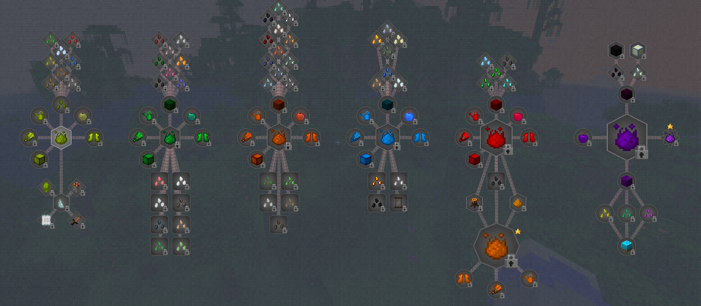

其内容包含所有矿物及生物，例如木头，水产，所有矿物：难得素，ATM矿，以及下界之星和龙蛋。

只有你想不到，没有种不了的。

那么后期要如何种地呢？当然是自动化种地了。

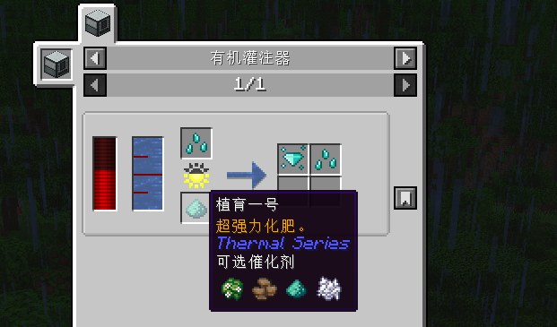

使用有机灌注器配合催化剂量产达到种地最大效率。

当然，这并不会写在任务书中，只靠你自己探索了

### 养蜂！

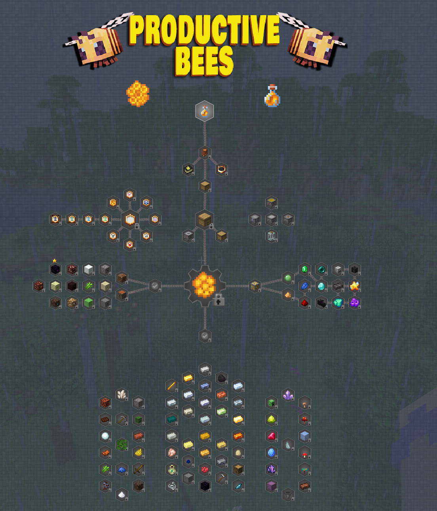

与种地类似，所有资源即可从蜜蜂的产物获取。

由于我游玩时未走此路线，故无法做太多陈述。
## 科技？科技！

ATM 官方任务书中给出的最终目标是制作 ATM锭。

如果你要实现最终目标并成功量产，那么就必不可少使用科技类，还记得我第一次接触这个整合包，科技模组应接不暇地进入我的眼中，为了搞清它们都是如何使用的，我的后台永远有一个浏览器。

你的科技树在一点点的发展，这就是科技包的成就感，但你看到基地中的机器与自动化流水线，能忍住不笑的都是神人了。

### 新手最好的入门教程

ATM对于每个大型mod都有属于其自己的章节

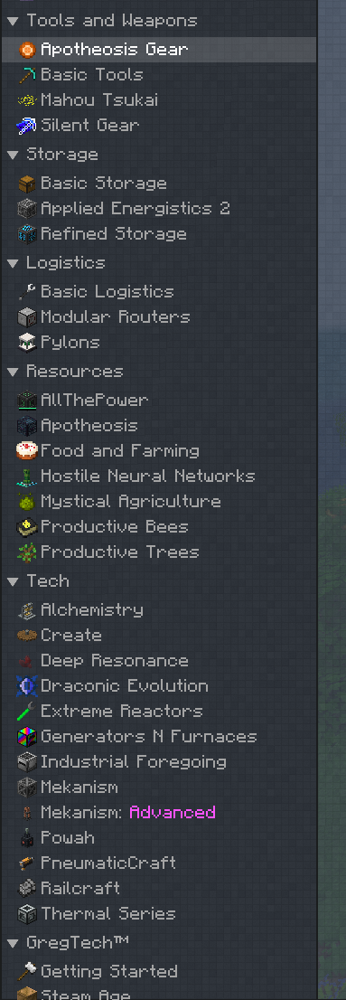

其内容详细至如果你第一次接触，你完全可以根据任务书的内容入门。

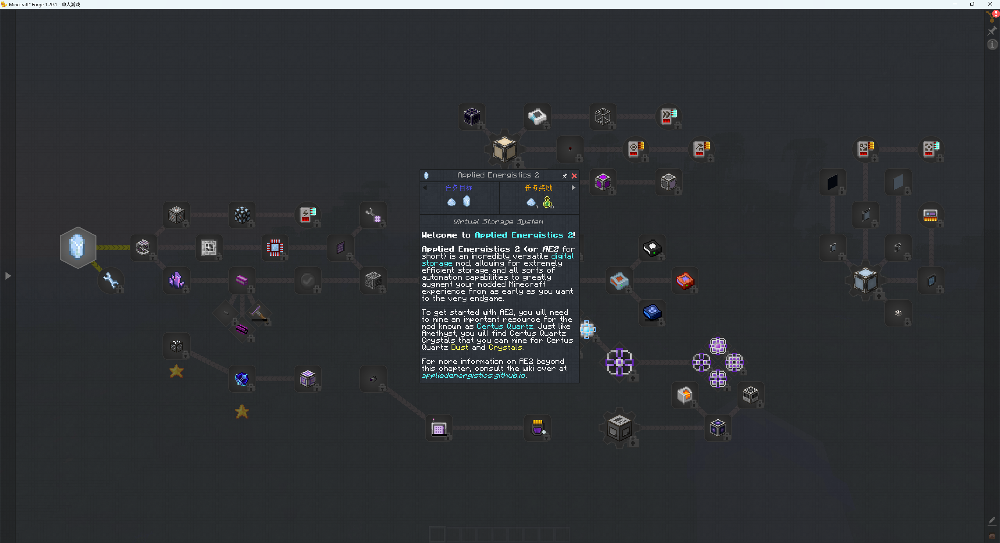

### 统一度量衡

ATM最为水槽包，其对于模组矿物的整合，避免了马铃薯与土豆同台竞技，番茄和西红柿相互打架的场景。再也不用担心冲突的合成表与不兼容的矿物

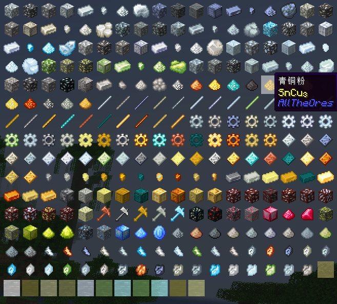

而且，对于众多模组的扳手，ATM都做了调整，你只需任意扳手即可实现所有扳手的功能！不需要单独制作模组指定的扳手了。

### 肝帝科技

（格雷科技）

如果你觉得ATM之星太没有挑战度了，你可以选择挑战一下格雷之星：

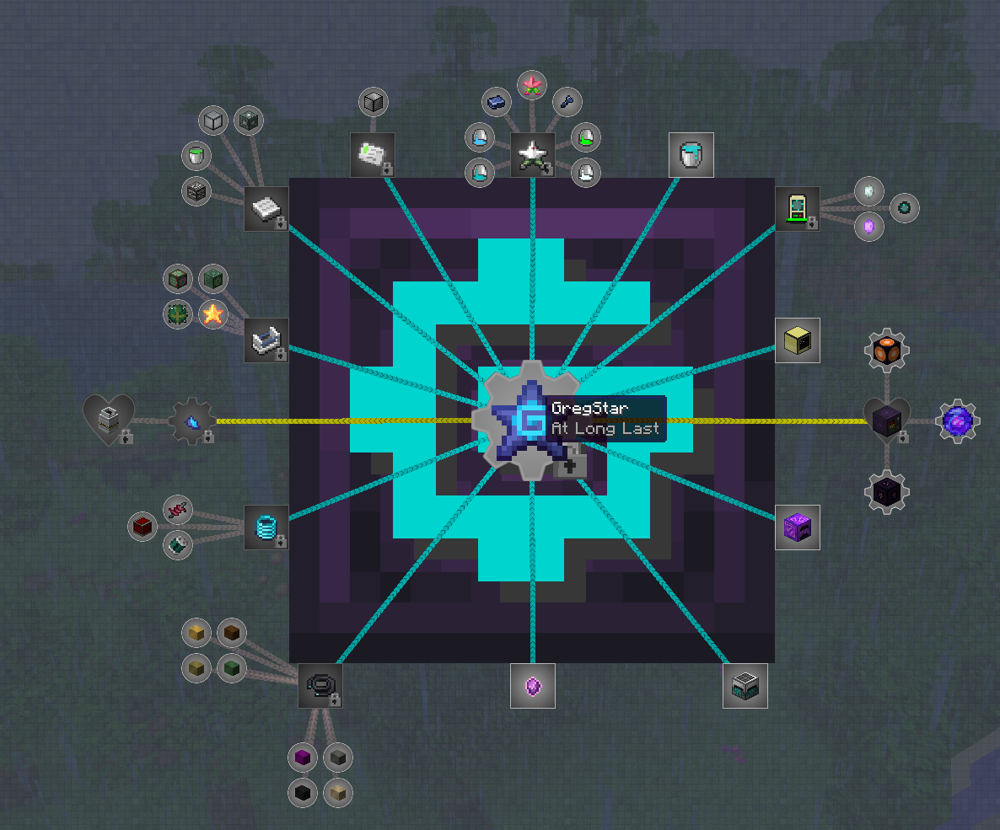

当然，我是没有深入体验过格雷科技的。

## 不止科技！

### 轮椅！

#### 无敌的武器

在ATM9中，有一把最强的武器。

“摩根剑”

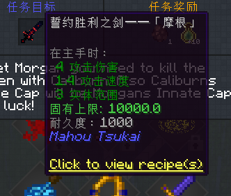

你可能会好奇，为什么只有4伤害？

但是如果我告诉你，击杀村民可以永久提高伤害呢？

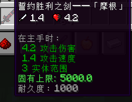

到了后期，叠到1000伤害都不是问题。

#### 突破上限的附魔

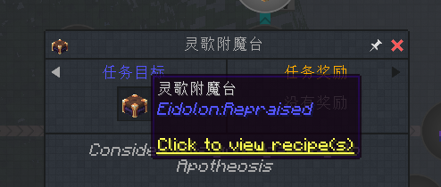

ATM中突破附魔上限有很多方法，灵歌附魔台就是其中方法之一。

#### 挖矿维度

有那么一个维度，由矿物构成。

就是ATM挖矿维度了

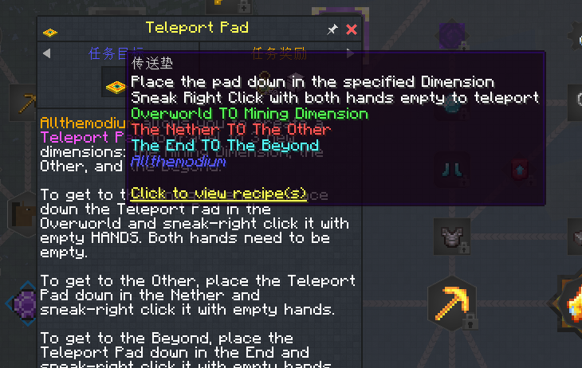

当你挖到第一个ATM矿后，就可以前往此维度。

---

在科技闲暇之余，也别忘了探索。

### 我们的目标不止地球

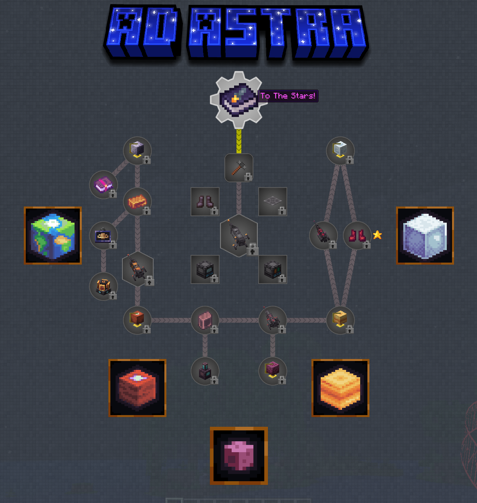

AD ASTRA 模组可以让你置身外太空，哪个男孩不想亲手组装一个火箭呢？

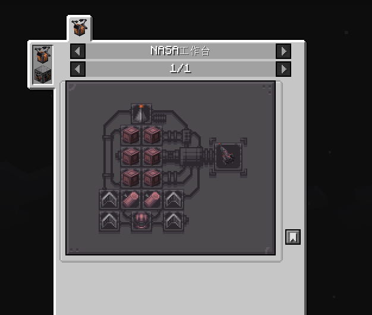

### 暮色森林

ATM中暮色森林真的有存在感吗。

还记得当时我通过叠1000+的摩根剑一路推过去的。

## 养老

当你看向你的流水线，你还剩下什么？

不妨来建筑吧！

使用药水卡永久飞行后，其建筑体验也是非常不错的。

内置的建筑手杖和建筑小帮手都能起到很好的辅助作用

##  小技巧

### 永久飞行

你可以制作飞行药水，然后再使用药水过滤卡来达成永久飞行。

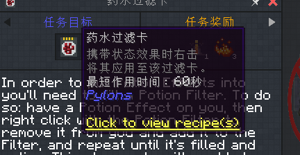

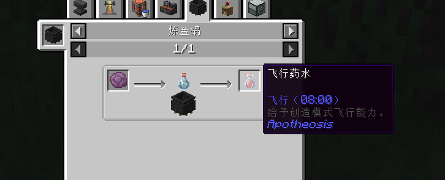

## 后言

这是第一次写整合包测评，因为最近玩了太多的整合包导致想开个新坑。

ATM是在我4月份的时候玩的，现在过去四个月了，内容就这么少，算是一个开头吧！