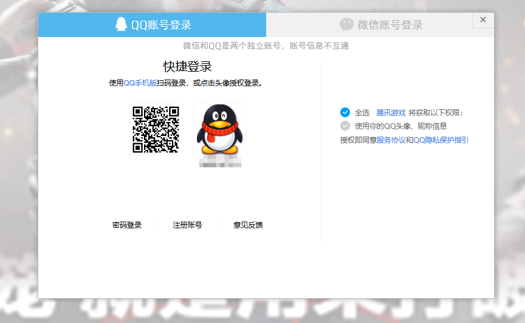
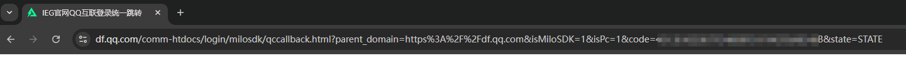
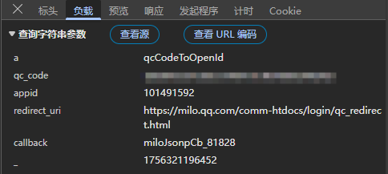
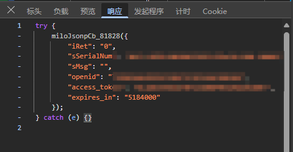

# 写在前面

获取到openid与accesstoken后可以通过api获取三角洲行动的各种内容：

例如个人信息/战绩/特勤处/物品价格/比赛记录等等。

[【三角洲行动数据API】欢迎大家 - 三角洲行动数据接口](https://df-api.apifox.cn/)

# 获取流程

三角洲的官网使用内嵌登陆：



```html
<iframe src="https://graph.qq.com/oauth2.0/authorize?response_type=code&amp;state=STATE&amp;client_id=101491592&amp;redirect_uri=https%3A%2F%2Fmilo.qq.com%2Fcomm-htdocs%2Flogin%2Fqc_redirect.html%3Fparent_domain%3Dhttps%253A%252F%252Fdf.qq.com%26isMiloSDK%3D1%26isPc%3D1" frameborder="0" id="milo-qcwx-frame-qc" class="qcwx-frame-qc"></iframe>
```

如果你在新标签页打开此**iframe**，那么你扫码后会跳转至：



`https://df.qq.com/comm-htdocs/login/milosdk/qccallback.html?parent_domain=https%3A%2F%2Fdf.qq.com&isMiloSDK=1&isPc=1&code=1A1B4C5D1E4F1A1B4C5D1E4F1A1B4C5D1E4F&state=STATE`

然后，就没有然后了。


如果你在官网登陆，你会发现：





其使用上一步链接中的code换取openid与access_token

# 自动化获取

现在，思路很清晰了。

首先获取二维码图片：

```js
  const img = await axios.get(
    "https://xui.ptlogin2.qq.com/ssl/ptqrshow?appid=716027609&e=2&l=M&s=3&d=72&v=4&t=0.06671855005524596&daid=383&pt_3rd_aid=101491592&u1=https%3A%2F%2Fgraph.qq.com%2Foauth2.0%2Flogin_jump",
    {
      responseType: "arraybuffer",
    }
  );
```

记住，二维码获取后会返回cookie，内包含**qrsig**

qrsig需轮询检查登陆状态！

```js
  const url = new URLSearchParams(img.headers["set-cookie"][0]);
  const qrsig = url.get("qrsig").split(";")[0];
```

获取qrsig后即可轮询：

```js
  const timer = setInterval(async () => {
    const url =
      "https://xui.ptlogin2.qq.com/ssl/ptqrlogin?u1=https%3A%2F%2Fgraph.qq.com%2Foauth2.0%2Flogin_jump&ptqrtoken=" +
      key +
      "&ptredirect=0&h=1&t=1&g=1&from_ui=1&ptlang=2052&action=2-0-1756217567930&js_ver=25072815&js_type=1&login_sig=&pt_uistyle=40&aid=716027609&daid=383&pt_3rd_aid=101491592&&o1vId=9a9b03289adb1141c6a53aa8df0eca08&pt_js_version=0daa4751";
    const req = await axios.get(url, {
      headers: {
        "user-agent":
          "Mozilla/5.0 (Windows NT 10.0; Win64; x64) AppleWebKit/537.36 (KHTML, like Gecko) Chrome/139.0.0.0 Safari/537.36 Edg/139.0.0.0",
        cookie:
          "__aegis_uid=1756216908550-2597; pt_local_token=0.47680695788599137; _qpsvr_localtk=0.862921772350107; olu=c93293d92eb88dec198ab871e65cf65f1e43475937cb9644; eas_sid=71T7L5U6G2Z1k6X9b0b4i1C1u4; qrsig=" +
          qrsig,
        Host: "xui.ptlogin2.qq.com",
        referer:
          "https://xui.ptlogin2.qq.com/cgi-bin/xlogin?appid=716027609&daid=383&style=33&login_text=%E7%99%BB%E5%BD%95&hide_title_bar=1&hide_border=1&target=self&s_url=https%3A%2F%2Fgraph.qq.com%2Foauth2.0%2Flogin_jump&pt_3rd_aid=101491592&pt_feedback_link=https%3A%2F%2Fsupport.qq.com%2Fproducts%2F77942%3FcustomInfo%3Dmilo.qq.com.appid101491592&theme=2&verify_theme=",
      },
    });
  }, 1000);
```

其中，我们需要提供 **ptqrtoken** 与 **qrsig**：

qrsig已在上文提及，那么ptqrtoken是何方神圣？

其是使用qrsig利用hash33加密获取的：

```js
function getPtqrtoken(qrsing) {

  let hash = 0;

  for (let i = 0; i < qrsing.length; i++) {

    hash += ((hash << 5) & 0x7fffffff) + qrsing.charCodeAt(i);

    hash &= 0x7fffffff; // 保证在 32 位正整数范围

  }

  return hash & 0x7fffffff;

}
```

使用此函数即可获得

当你扫码后，将会携带cookie跳转至`https://graph.qq.com/oauth2.0/authorize`

你需要获取跳转时携带的cookie与cookie中的p_skey：

```js
      const getcookie = await axios.get(req.data.split("'")[5], {

        maxRedirects: 0,

        validateStatus: null,

      });
      
      //转换为浏览器的cookie格式
      const a = getcookie.headers["set-cookie"].toString();

      const cookieArr = a.split(/,(?=[^ ]+\=)/);

      const cookies = cookieArr.map((c) => c.trim().split(";")[0]);

      const cookieHeader = cookies.join("; ");
      
      //压力给到下一步
      getaskey(

        gsp.headers["set-cookie"][5].split("=")[1].split(";")[0],

        cookieHeader

      );
```

所以，你必须将上一步的cookie复制过来，发送请求获取code

```js
async function getaskey(p_skey, cookie) {

  console.log(cookie);

  const a = await axios.post(

    "https://graph.qq.com/oauth2.0/authorize",

    qs.stringify({

      response_type: "code",

      client_id: "101491592",

      redirect_uri:

        "https://milo.qq.com/comm-htdocs/login/qc_redirect.html?parent_domain=https://df.qq.com&isMiloSDK=1&isPc=1",

      state: "STATE",

      switch: "",

      form_plogin: 1,

      src: 1,

      update_auth: 1,

      openapi: 1010,

      g_tk: getGTK(p_skey).toString(),

      auth_time: Date.now(),

      ui: "979D48F3-6CE2-4E95-A789-3BD3187648B6",

    }),

    {

      headers: {

        "Content-Type": "application/x-www-form-urlencoded",

        referer: "https://xui.ptlogin2.qq.com/",

        cookie: cookie,

      },

      maxRedirects: 0,

      validateStatus: null,

    }

  );

  return getfinall(a.headers["location"]);

}
```

其中，`getGTK(p_skey).toString()`是使用上一步中p_skey获取g_tk，加密如下：

```js
function getGTK(sKey) {

  let hash = 5381;

  for (let i = 0; i < sKey.length; i++) {

    hash += (hash << 5) + sKey.charCodeAt(i);

    // 保证 32 位无符号整数

    hash &= 0x7fffffff;

  }

  return hash & 0x7fffffff;

}
```

然后，会返回302并提供跳转后的链接（示范中截图最后一步）

我们需要截取其中的code发送请求获得最终的openid与accesstoken：

```js
async function getfinall(params) {

  const code = params.split("&code=")[1].split("&state=STATE")[0];

  const resp = await axios.get("https://ams.game.qq.com/ams/userLoginSvr", {

    params: {

      a: "qcCodeToOpenId",

      qc_code: code,

      appid: "101491592",

      redirect_uri: "https://milo.qq.com/comm-htdocs/login/qc_redirect.html",

      callback: "miloJsonpCb_86690",

      _: Date.now,

    },

    headers:{

        referer:'https://df.qq.com/'

    }

  });

  const openid = resp.data.split('"openid":"')[1].split('",')[0]

  const ass = resp.data.split('"access_token":"')[1].split('",')[0]

  return {

    openid:openid,

    ass:ass

  }

}
```

自此，完结。

代码写的粗糙，优化内容还有很多，尽请指点！